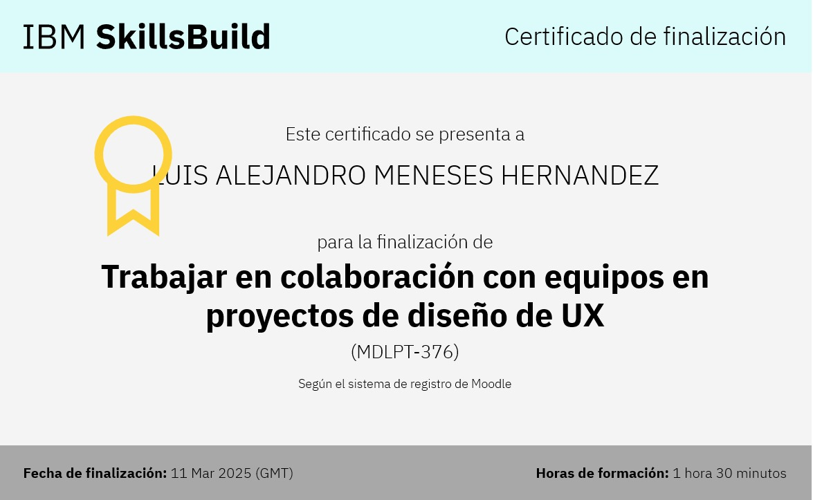

### Modulo 6 Evaluacion Final
#### Working Collaboratively with Teams on UX Design Projects

En el sexto módulo, exploramos la importancia del trabajo colaborativo en proyectos de UX. Aprendimos cómo los diseñadores UX coordinan esfuerzos con otros equipos, como desarrolladores y gerentes de producto, para garantizar una experiencia de usuario óptima. Analizamos la relevancia de una comunicación clara, el uso de herramientas colaborativas y una documentación estructurada. También estudiamos la organización de roles dentro del equipo, el proceso de entrega de diseños y la resolución conjunta de problemas. Finalmente, revisamos un caso de estudio donde se aplicaron estas prácticas para mejorar la colaboración en un proyecto de diseño UX.

## Certificado
