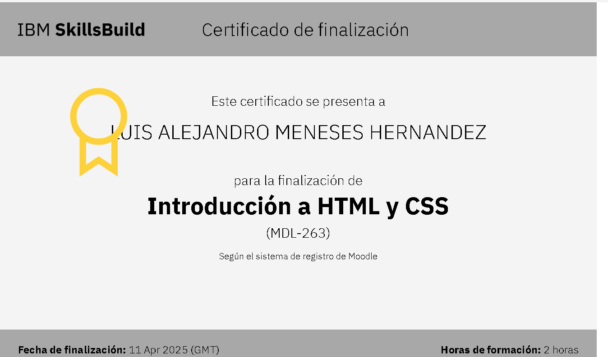

## Módulo 3: Introducción a HTML y CSS
El módulo 3 cubre aspectos esenciales de HTML y CSS para construir páginas web bien estructuradas. Aprendimos a usar etiquetas semánticas como <nav>, <article> y <header>, lo que mejora la accesibilidad y el SEO. También se explicó la importancia de organizar y vincular estilos a través de CSS para mantener un diseño consistente. Es clave seguir buenas prácticas como la separación de contenido y estilo usando hojas de estilo externas.

