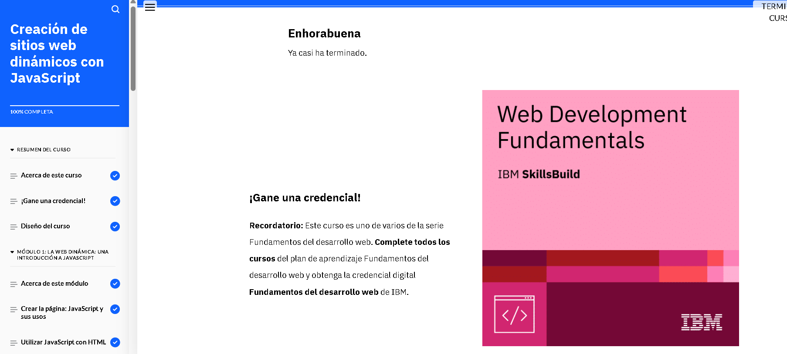

## Módulo 4: Bringing Websites to Life with JavaScript
En este módulo, aprendimos cómo llevar la interactividad a un sitio web utilizando JavaScript. La manipulación dinámica de elementos con JavaScript es esencial para mejorar la experiencia del usuario, ya que permite que las páginas respondan a las acciones del usuario, como hacer clic en un botón o desplazarse por la página.

Temas clave:

Manejo de eventos: Aprendimos a usar eventos como onclick, onmouseover, onload, entre otros, para realizar acciones específicas cuando un usuario interactúa con la página.

Funciones: Vimos cómo las funciones permiten modularizar el código y hacer que la lógica del sitio sea más organizada y reutilizable.
Objetos y propiedades: Entendimos cómo trabajar con objetos en JavaScript y cómo podemos manipular sus propiedades para cambiar el comportamiento de los elementos en la página.

Buenas prácticas: Se enfatizó la importancia de separar el código JavaScript del HTML, utilizando archivos externos para facilitar el mantenimiento y mejorar la colaboración en equipos.

JavaScript es fundamental para crear experiencias web interactivas y personalizadas, lo que mejora la usabilidad y la interacción del usuario en los sitios web.

