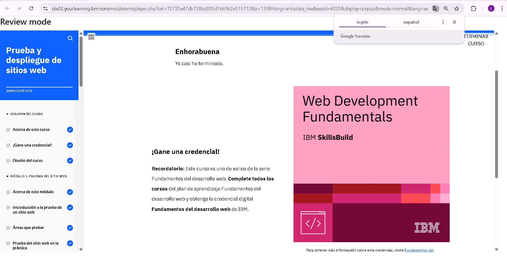

## Website Testing and Deployment
En el proceso de desarrollo de sitios web, la prueba es una etapa crucial para garantizar que el sitio cumpla con las expectativas de los usuarios y funcione correctamente. Los desarrolladores realizan diferentes tipos de pruebas, como las pruebas funcionales, de regresión y de usabilidad, para asegurarse de que todas las características del sitio se comporten como se espera.

Una de las principales razones por las que realizamos pruebas es para asegurar una buena experiencia de usuario. Esto implica que el sitio sea accesible, rápido y fácil de navegar, sin errores que puedan frustrar a los usuarios. Además, las pruebas ayudan a identificar problemas de rendimiento que podrían afectar la carga del  sitio, lo cual es fundamental, especialmente cuando se tiene un público diverso utilizando diferentes dispositivos y conexiones.

