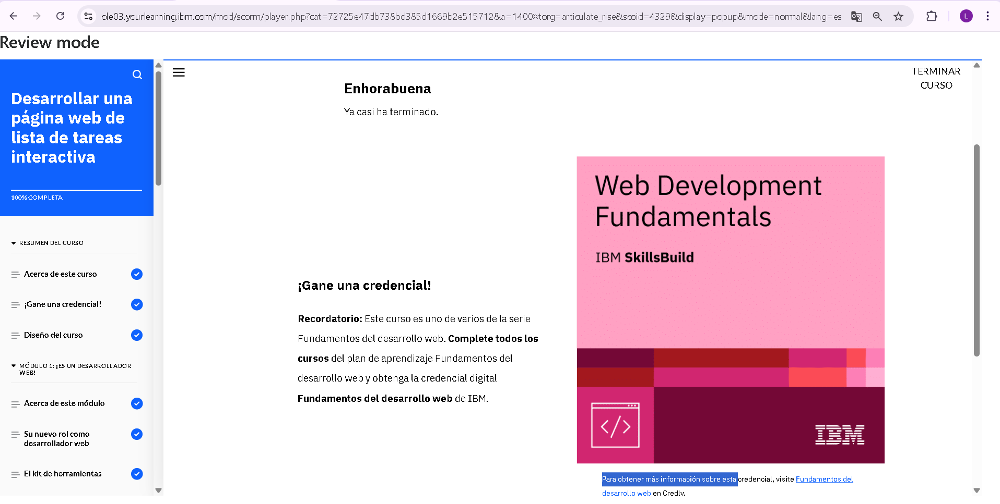

## Module 06: Develop an Interactive Task List Web Page

En el desarrollo de una página de tareas interactiva, aprendimos a combinar HTML, CSS y JavaScript para crear una experiencia funcional y visualmente clara. Desde el inicio, usamos HTML para estructurar los elementos clave como el campo de entrada, el botón de añadir y la lista de tareas.

Con CSS, le dimos estilo al diseño, asegurándonos de que se viera bien tanto en escritorio como en dispositivos móviles. Aplicamos clases para personalizar colores, márgenes y comportamientos como el scroll cuando la lista se hacía muy larga.

La parte más dinámica vino con JavaScript, donde agregamos interactividad: permitir al usuario añadir tareas con el botón o presionando Enter, marcar tareas como completadas (tachándolas) y eliminarlas. También implementamos validaciones para evitar tareas vacías, mostrando mensajes claros.

Finalmente, realizamos pruebas para verificar que todo funcionara como se esperaba y que la interfaz respondiera bien en distintos tamaños de pantalla. Este módulo nos ayudó a entender cómo integrar el diseño y la lógica para construir una página web funcional, intuitiva y adaptable.
