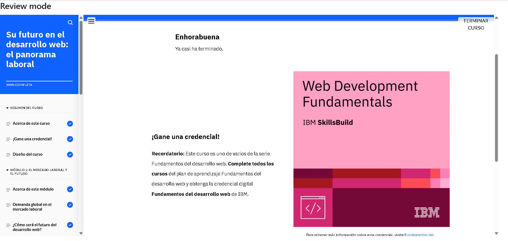

## Module 7: Your Future in Web Development
Aprendí sobre los distintos roles dentro de un equipo de desarrollo web, como el front-end developer, back-end developer, full-stack developer, QA tester, UX designer, y product manager. Cada uno tiene funciones específicas y complementarias que permiten que un proyecto web avance correctamente.

También entendí que hay muchas herramientas y frameworks populares, como React para el front-end o Express y Flask para el back-end, y que conocer alguno de ellos es clave para ser competitivo en el mercado laboral.

Otra cosa importante fue que no solo se valoran las habilidades técnicas, sino también las habilidades blandas como la comunicación, el trabajo en equipo y el pensamiento crítico. Además, los títulos de los trabajos pueden variar mucho, así que es importante leer bien las descripciones para saber qué buscan realmente las empresas.

