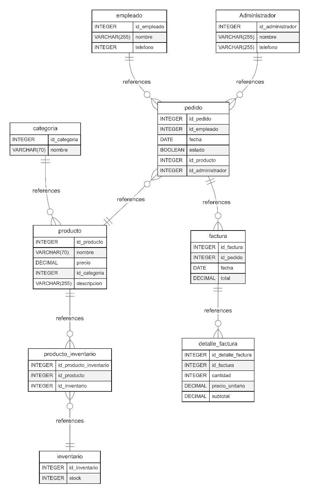
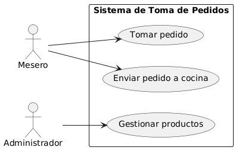
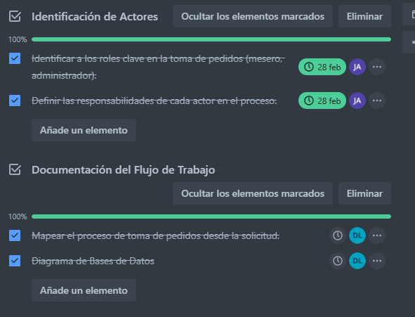

# 01-HU Entendimiento del negocio para la toma de pedidos en puestos de comidas rápidas.

### Descripción:
Como analista de negocio, quiero entender el flujo de toma de pedidos en puestos de comidas rápidas, para definir correctamente los requisitos del sistema y optimizar el proceso de atención al cliente.

### Criterios de Aceptación:

Se identifican los actores principales en el proceso de toma de pedidos (mesero, administrador).

Se documenta el flujo de un pedido desde su creación hasta su entrega y pago.

Se establece la relación entre pedidos, cocina y disponibilidad de platos.

### Prioridad: Alta

### Dependencias:
Ninguna (es el punto de partida para el desarrollo del sistema).

### Estimación:
5 Story Points.

