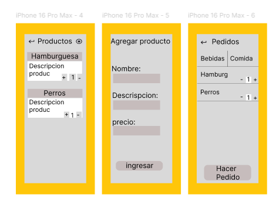
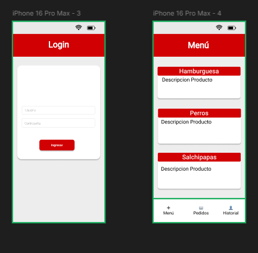

# 02-HU Visualización de la app de Pedidos, Diseño XI-XU

### Descripción:
Como mesero, quiero ver el menú de para seleccionar los platos que el cliente desea ordenar.

### Criterios de Aceptación:

El menú está organizado por categorías (comidas y bebidas).

Cada plato muestra su nombre, descripción y precio.

La interfaz permite navegar entre categorías fácilmente.

Prioridad: Alta

### Dependencias:
Ninguna (puede desarrollarse de manera independiente).

### Estimación:
3 Story Points

